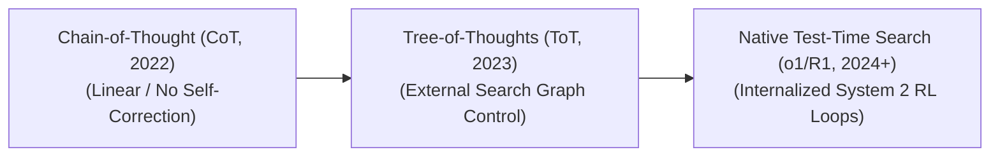

  

# Awesome Tree-of-Thoughts (ToT) 🌳💭

    

**A curated list of awesome papers, frameworks, libraries, and resources focusing on the Tree-of-Thoughts (ToT) prompting paradigm, advanced LLM reasoning, test-time search, and inference-time compute strategies.**

---

## 🌟 Overview

The **Tree-of-Thoughts (ToT)** is an advanced prompt engineering and architectural framework that generalizes the classic **Chain-of-Thought (CoT)** paradigm. While CoT forces Large Language Models (LLMs) to generate linear, sequential reasoning steps (System 1 intuition), ToT enables models to explore multiple self-contained reasoning paths simultaneously (System 2 deliberation). 

By structuring intermediate reasoning steps as discrete "thoughts" within a search tree, ToT allows LLMs to actively branch out, evaluate their own intermediate progress, look ahead, and backtrack when a specific logical path hits a dead-end, vastly improving performance on complex planning, coding, and mathematical reasoning tasks.

---

## 1. The Chronological Evolution

The technical progression of structured reasoning has transitioned from simple verbal constraints to programmatic search abstractions, moving toward native reinforcement-learned cognitive loops.

| Era / Concept | Mechanism & Details | First Used (Year) | First-Used Paper |
| :--- | :--- | :--- | :--- |
| [**The Linear Sequence Era (Chain-of-Thought)**](docs/chain_of_thought.md) | **Concept:** Discovered by Wei et al. Appending `"Let's think step by step"` instructs the model to lay out intermediate milestones sequentially. **Limitation:** Rigid and highly fragile. If the model commits a logical or mathematical error early in the text generation stream, it cannot alter its trajectory and will cascade into an incorrect final answer. | 2022 | [Wei et al. (2022)](https://arxiv.org/abs/2201.11903) |
| [**The Abstraction & Search Graph Era (Yao et al. / Long)**](docs/abstraction_search_graph.md) | **Concept:** Formally formalized as the Tree-of-Thoughts framework. It wrapped the LLM inside an external algorithmic scaffold (such as a Python execution script). The script intercepts the model's outputs, treats sentences as nodes in a tree, and runs graph search algorithms to navigate options. **Limitation:** Heavy API latency overhead and high token ingestion costs, as the model must constantly evaluate multiple redundant text branches. | 2023 | [Yao et al. (2023)](https://arxiv.org/abs/2305.10601) / [Long (2023)](https://arxiv.org/abs/2305.08291) |
| [**The Native Inference-Time Compute Era**](docs/native_inference_compute.md) | **Concept:** Popularized by modern frontier architectures like OpenAI's **o1/o3** and DeepSeek's **DeepSeek-R1**. These systems internalize the tree-search properties discovered in ToT via large-scale Reinforcement Learning (RL), allowing hidden backtracking and self-correction to happen natively within the inference token generation stream. | 2024 | [OpenAI (2024)](https://openai.com/index/learning-to-reason-with-llms/) |

---

## 2. Core Search & Navigation Variants

Tree-of-Thoughts architectures rely on classical graph-theory traversal algorithms to determine how the model explores and expands the reasoning tree.

| Variant | Mechanism & Application | First Used (Year) | First-Used Paper |
| :--- | :--- | :--- | :--- |
| [**Breadth-First Search (BFS) ToT**](docs/bfs_tot.md) | **Mechanism:** Expands and evaluates all possible reasoning thoughts at the current layer depth before moving deeper into the solution matrix. **Application:** Ideal for highly structured tasks with bounded step horizons (e.g., creative writing planning or strategic scheduling), where checking all near-term variations prevents fatal structural mistakes. | 2023 | [Yao et al. (2023)](https://arxiv.org/abs/2305.10601) |
| [**Depth-First Search (DFS) ToT**](docs/dfs_tot.md) | **Mechanism:** Follows a single reasoning thread as deeply as possible. If the path's evaluation score falls below a pre-defined threshold, the engine cuts off the branch, triggers a backtrack, and returns to the previous node to try an alternative branch. **Application:** Perfect for deep math proofs, crossword puzzles, or coding exercises where a single mistake invalidates the entire remaining path. | 2023 | [Yao et al. (2023)](https://arxiv.org/abs/2305.10601) |
| [**Monte Carlo Tree Search (MCTS) ToT**](docs/mcts_tot.md) | **Mechanism:** Pairs the LLM with a value-estimation heuristic to run simulated playouts, estimating the statistical probability of downstream success for each thought node. | 2023 | [Hao et al. (2023)](https://arxiv.org/abs/2305.14992) / [Zhou et al. (2023)](https://arxiv.org/abs/2310.04406) |

---

## 3. Thought Evaluation & State Validation Types

To navigate a search tree effectively, the system must judge the validity of intermediate thoughts. ToT implements distinct architectural evaluation strategies.

| Evaluation Type | Mechanism | First Used (Year) | First-Used Paper |
| :--- | :--- | :--- | :--- |
| [**Independent Node Voting**](docs/independent_voting.md) | **Mechanism:** The LLM acts as its own jury. Given a set of generated candidate thoughts, the model runs a separate prompt pass to vote on which thought is the most logical (e.g., `"Given these three steps, which one is mathematically sound? Answer 1, 2, or 3"`). | 2023 | [Yao et al. (2023)](https://arxiv.org/abs/2305.10601) |
| [**Heuristic Value Scoring**](docs/heuristic_scoring.md) | **Mechanism:** The model evaluates a single thought in isolation, returning a programmatic classification or scalar score (e.g., `[sure]`, `[likely]`, or `[impossible]`). | 2023 | [Yao et al. (2023)](https://arxiv.org/abs/2305.10601) |
| [**Process-Supervised Reward Models (PRMs / External Verifiers)**](docs/process_supervised_rewards.md) | **Mechanism:** Drops LLM self-evaluation entirely. The node is evaluated by an external, specialized reward model or software compiler sandbox, providing a highly precise, un-hallucinated verification loop. | 2023 | [Lightman et al. (2023)](https://arxiv.org/abs/2305.20050) |

---

## 4. Production Engineering Challenges & Mitigations

Deploying external tree-search wrappers inside real-world production environments introduces severe token constraints and latency penalties.

| Challenge | Bottleneck & Mitigation | First Used (Year) | First-Used Paper |
| :--- | :--- | :--- | :--- |
| [**The Token Explosion & Cost Multiplier**](docs/token_explosion_cost.md) | **The Bottleneck:** Because a ToT tree branch can contain dozens of evaluated thoughts, a single complex prompt query can easily cannibalize hundreds of thousands of tokens, inflating API billing and quickly saturating infrastructure rate limits. **Mitigation:** Implementing **Pruning Rules** (like Alpha-Beta Pruning or strict beam widths) to immediately terminate low-scoring thought nodes at early levels, preventing the system from calculating unpromising branches. | 2023 | [Yao et al. (2023)](https://arxiv.org/abs/2305.10601) |
| [**High Time-to-First-Token (TTFT) Latency**](docs/ttft_latency.md) | **The Bottleneck:** Running multiple back-and-forth evaluation prompts before delivering a final answer means the user must wait significantly longer for an output. **Mitigation:** Executing thought generation across parallel infrastructure worker nodes or leveraging **Speculative Decoding** to accelerate the execution speed of intermediate evaluation passes. | 2022 | [Leviathan et al. (2022)](https://arxiv.org/abs/2211.17192) |

---

## 5. Frontier Real-World Applications

| Application | Description & Implementation | First Used (Year) | First-Used Paper |
| :--- | :--- | :--- | :--- |
| [**Complex Combinatorial Planning & Scheduling**](docs/combinatorial_planning.md) | **Application:** Solves logistical optimization problems, such as parsing intricate airline fleet crew shifts under strict regulatory resting rules. ToT maps multiple scheduling combinations simultaneously, backtracking gracefully when a routing choice violates a down-line timing constraint. | 2023 | [Yao et al. (2023)](https://arxiv.org/abs/2305.10601) / [Hao et al. (2023)](https://arxiv.org/abs/2305.14992) |
| [**Automated Competitive Mathematical Proving**](docs/math_proving.md) | **Application:** Deployed to solve Math Olympiad or advanced engineering proofs. The model tests various algebraic identities, tracks parenthetical constraints, and shifts to alternative mathematical fields if an initial proof vector collapses. | 2024 | [OpenAI (2024)](https://openai.com/index/learning-to-reason-with-llms/) / [Trinh et al. (2024)](https://www.nature.com/articles/s41586-023-06747-5) |
| [**Multi-Turn Strategic Game Analytics**](docs/strategic_game_analytics.md) | **Application:** Powers game theory and complex simulation forecasting (e.g., text-based chess, legal trial forecasting, or corporate war-gaming). The framework maps out branch lines of action, anticipating an adversary's counter-moves over a deep strategic execution horizon. | 2022 | [FAIR et al. (2022)](https://www.science.org/doi/10.1126/science.ade9097) / [Hao et al. (2023)](https://arxiv.org/abs/2305.14992) |
