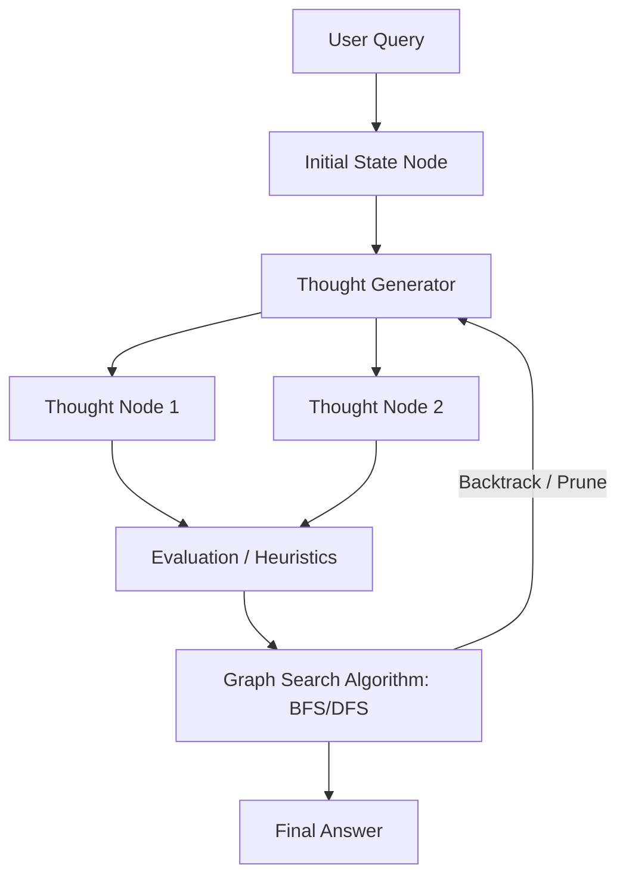

# Abstraction & Search Graph Era

## Overview
This era marks the shift from linear text generation to external search graphs (like Trees or Graphs of Thoughts). The LLM is wrapped in an external programmatic scaffold (e.g., Python execution scripts) to search, evaluate, and navigate reasoning paths.

## Architecture & Flow

## Key Attributes
- **Branching Reasoning**: Explores multiple paths simultaneously.
- **External Controller**: Relies on a script to maintain the state tree and run search algorithms.
- **System 2 Deliberation**: Emulates slow, deliberate, analytical reasoning.

## Limitations
- **High Token Costs**: Processing multiple parallel branches incurs heavy token consumption.
- **API Latency**: Frequent API calls lead to long completion times.
