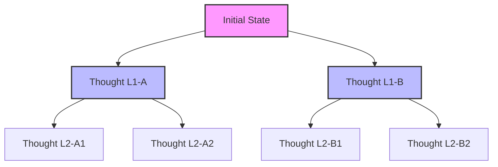

# Breadth-First Search (BFS) ToT

## Overview
Breadth-First Search (BFS) in Tree-of-Thoughts explores all potential reasoning thoughts at the current layer depth before moving deeper down the reasoning tree.

## Architecture & Flow

## Key Attributes
- **Layer-by-Layer Evaluation**: Assesses all options at depth $d$ before proceeding to $d+1$.
- **Beam Search Integration**: Typically uses a beam width to keep only the top-$k$ thoughts per layer.
- **Global Planning**: Suitable for tasks where global horizon decisions matter (e.g., creative writing, scheduling).

## Limitations
- **High Initial Latency**: Must wait for all nodes at the current level to be generated and evaluated.
