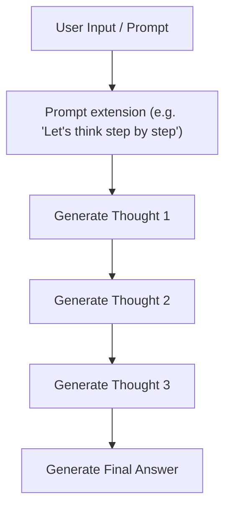

# Chain-of-Thought (CoT) Prompting

## Overview
Chain-of-Thought (CoT) prompting is a prompting strategy that improves the reasoning abilities of Large Language Models (LLMs) by directing them to generate a sequence of intermediate reasoning steps before arriving at the final solution.

## Architecture & Flow

## Key Attributes
- **Linear Progression**: The reasoning proceeds in a single, unidirectional path.
- **System 1 Intuition**: Emulates fast, sequential thinking.
- **Explainability**: Delivers a transparent thought trace for validation.

## Limitations
- **No Backtracking**: If the model makes a logical error early in the chain, it cannot correct itself.
- **Cascading Errors**: Early errors propagate, leading to incorrect final results.
