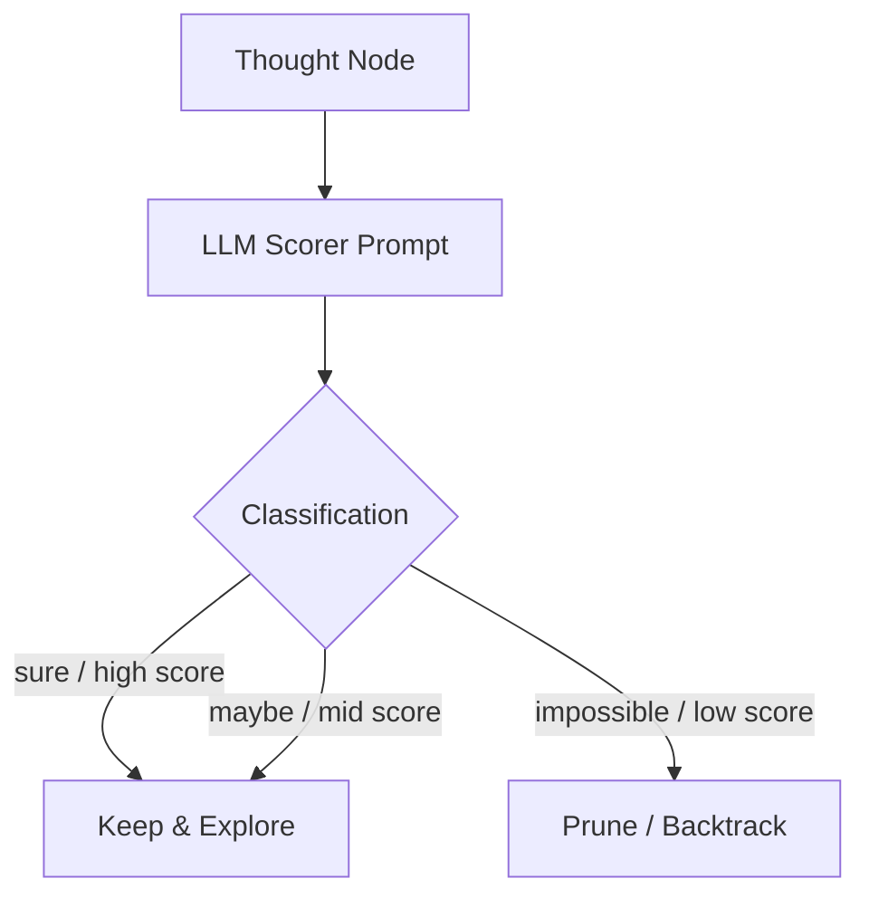

# Heuristic Value Scoring

## Overview
Heuristic Value Scoring evaluates thoughts in isolation. The LLM acts as an evaluator, assigning a classification (e.g., `[sure]`, `[likely]`, or `[impossible]`) or a scalar score to a single thought node.

## Architecture & Flow

## Key Attributes
- **Isolated Evaluation**: Evaluates thoughts independently of other candidates.
- **Early Pruning**: Instantly identifies dead-ends (`[impossible]`) to save compute.

## Limitations
- **Strict Thresholds**: Hard to calibrate scalar thresholds across different domains.
