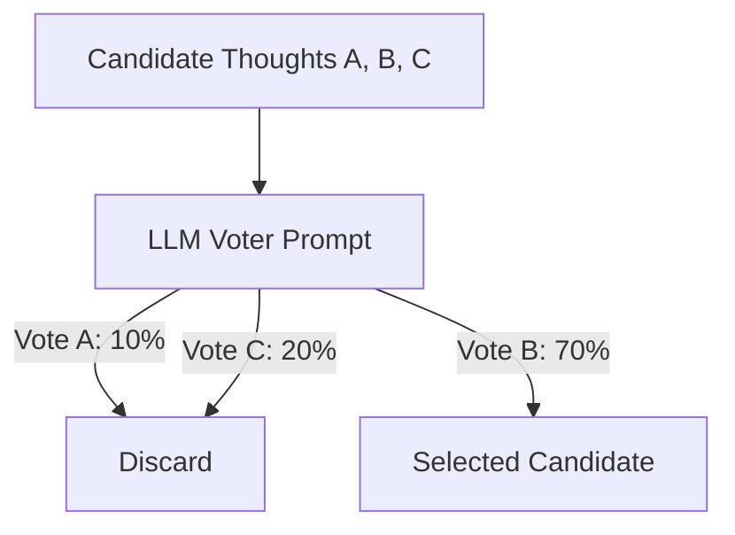

# Independent Node Voting

## Overview
Independent Node Voting is a thought evaluation strategy where the LLM acts as its own jury. Given a set of generated candidate thoughts, a separate prompt pass is executed to vote on the most logical candidate.

## Architecture & Flow

## Key Attributes
- **Comparative Analysis**: The LLM compares candidate thoughts directly against one another.
- **Democratic Selection**: Aggregates preferences over multiple voting runs to increase stability.

## Limitations
- **Intra-Prompt Bias**: The order in which candidates are listed in the voting prompt can bias the model's choices.
