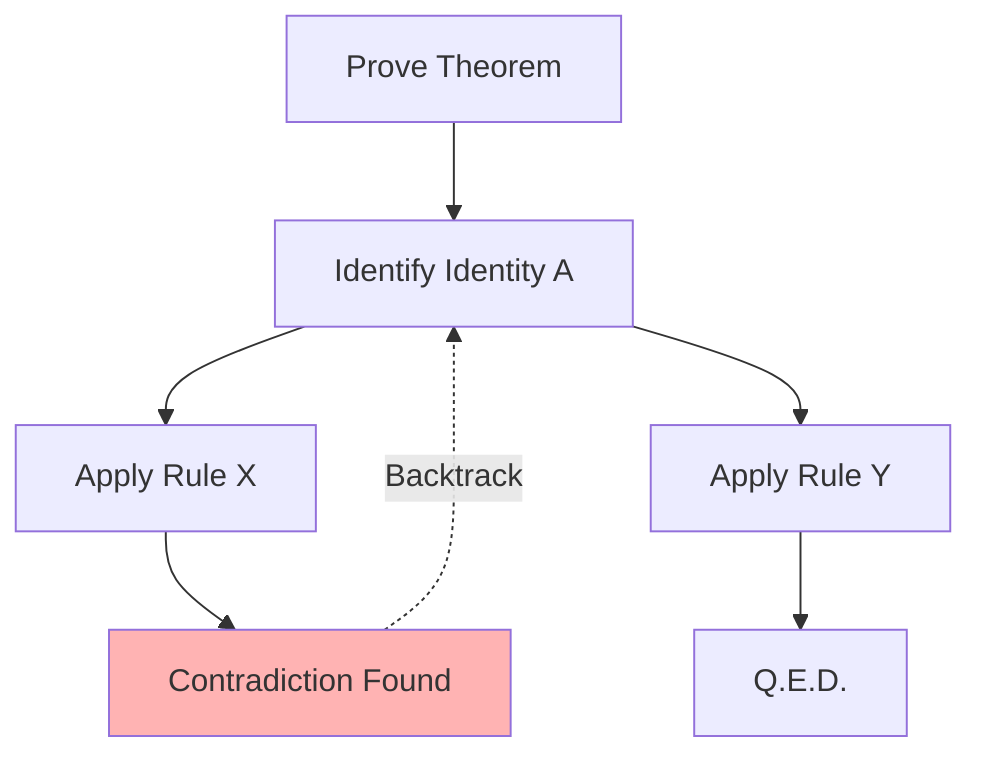

# Automated Competitive Mathematical Proving

## Overview
Mathematical proving requires extreme logical rigor where one wrong step invalidates the entire proof. ToT maps algebraic identities, verifies intermediate steps, and backtracks upon proof-path failures.

## Architecture & Flow

## Key Attributes
- **Formal Verifiers**: Links to external tools like Lean or symbolic solvers.
- **Self-Correction**: Iteratively adjusts theorem proving strategies based on error messages.
