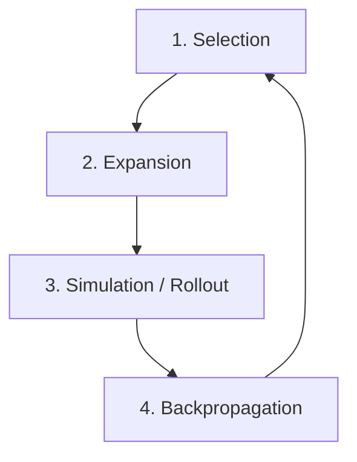

# Monte Carlo Tree Search (MCTS) ToT

## Overview
Monte Carlo Tree Search (MCTS) ToT combines the LLM with value heuristics to perform rollouts and simulations, balancing the exploration of new thought paths with the exploitation of high-performing paths.

## Architecture & Flow

## Key Attributes
- **UCT Formula**: Balances exploration and exploitation during thought selection.
- **Lookahead Simulations**: Simulates downstream paths to predict the probability of success.
- **Robust Decision Making**: Highly effective for complex planning, games, and math.

## Limitations
- **High Computation**: Requires many rollouts, resulting in high token costs.
