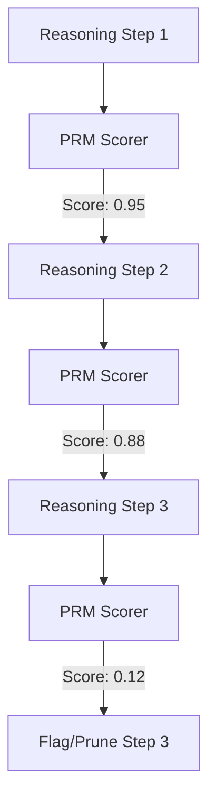

# Process-Supervised Reward Models (PRMs)

## Overview
Process-Supervised Reward Models (PRMs) score the intermediate steps of a reasoning process rather than just the final outcome. This step-by-step verification significantly reduces logical drift and hallucination.

## Architecture & Flow

## Key Attributes
- **Fine-Grained Feedback**: Evaluates each logical transition.
- **Reduced Hallucinations**: Catches logical errors immediately when they occur.
- **External Verification**: Often implemented using specialized, highly accurate verifier models.

## Limitations
- **High Labeling Cost**: Training PRMs requires high-quality, step-by-step human annotations.
