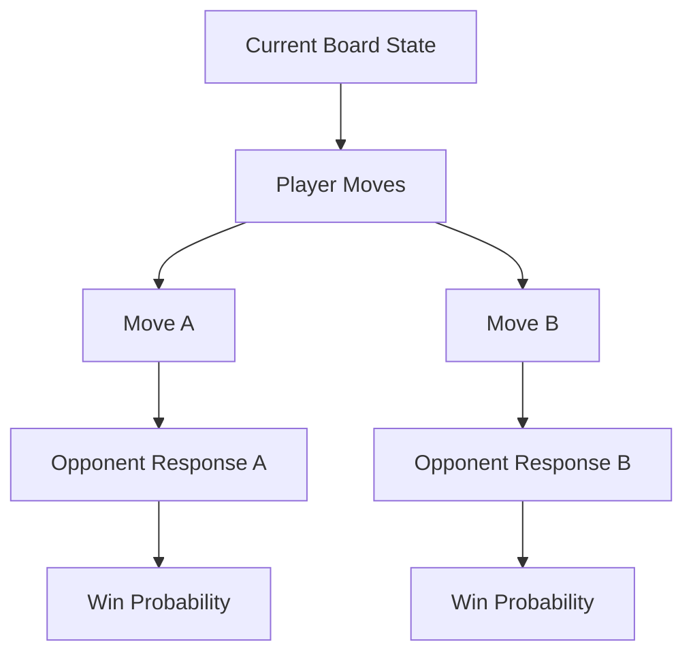

# Multi-Turn Strategic Game Analytics

## Overview
Strategic games (e.g., Chess, Go, text-based games) require anticipating adversary actions over a deep planning horizon. ToT structures this interaction as a game tree, evaluating minimax search and node strategies.

## Architecture & Flow

## Key Attributes
- **Adversarial Search**: Anticipates opponent response nodes.
- **Value Evaluation**: Scores the quality of the board state.
