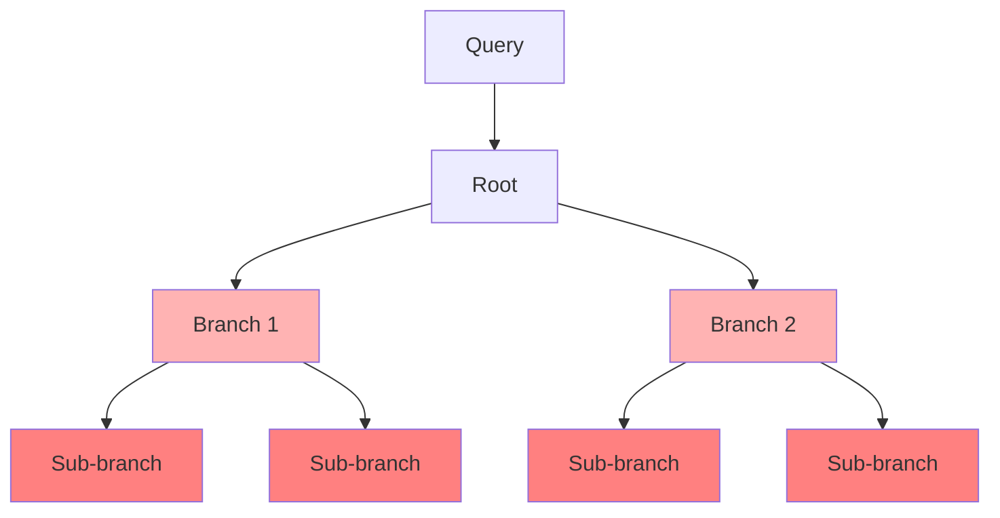

# Token Explosion & Cost Multiplier

## Overview
One of the primary challenges in Tree-of-Thoughts is the exponential growth of token usage. Generating and evaluating multiple branches causes API billing and rate limits to saturate quickly.

## Architecture & Flow

## Mitigations
- **Pruning Rules**: Drop unpromising nodes early (e.g., Alpha-Beta pruning).
- **Beam Width Limits**: Limit search width strictly to the top-$k$ nodes.
- **Caching**: Reuse previous prompt prefixes to save prompt evaluation tokens.
